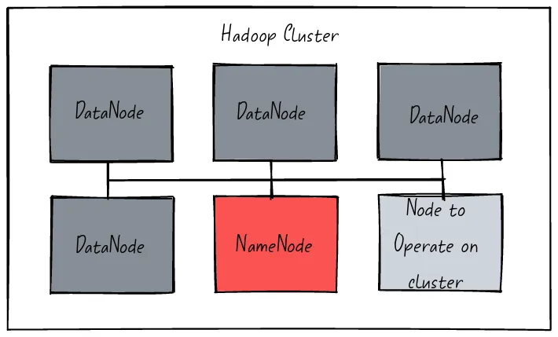
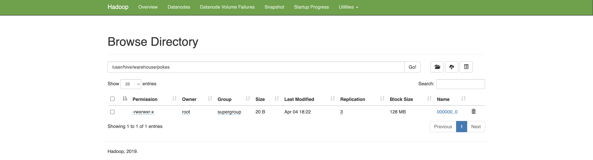
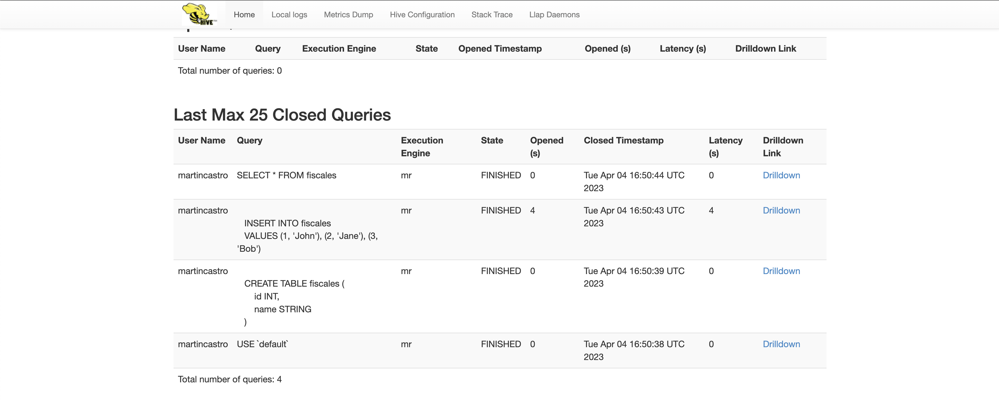

# Hadoop Hive Docker
Running Hive jobs using Docker


## Overview

#### HDFS

HDFS, or Hadoop Distributed File System, is a distributed file system designed to store and
process large datasets using commodity hardware. It is part of the Apache Hadoop ecosystem
and is widely used in big data processing. HDFS uses a master-slave architecture with one
NameNode and multiple DataNodes. The NameNode manages the file system metadata, while the
DataNodes store the actual data. This allows for scalable and fault-tolerant data storage
and processing. HDFS is optimized for batch processing and sequential reads, making it
well-suited for applications like log analysis, data warehousing, and machine learning.
However, it is not well suited for random writes and low-latency data access. HDFS is a
critical component of the Hadoop ecosystem and is used by many big data applications.
Its scalable and fault-tolerant design makes it a reliable choice for storing and
processing large datasets. Overall, HDFS plays a crucial role in the world of big
data and is an essential tool for data engineers and analysts.



#### Hive

Apache Hive is a data warehousing and SQL-like query tool built on top of the Hadoop
Distributed File System (HDFS). It provides a SQL-like interface for querying and
analyzing large datasets stored in HDFS or other Hadoop-compatible file systems.
Hive translates SQL-like queries into MapReduce jobs, which are executed on the
Hadoop cluster.

Hive is designed to be highly scalable, allowing you to process and analyze large
datasets using distributed computing resources. It provides a range of built-in
functions and operators for querying and manipulating data, as well as the ability
to define custom user-defined functions (UDFs) in Java, Python, or other programming
languages.

Hive also supports partitioning and bucketing of data for faster query execution,
as well as the ability to use external tables to access data stored outside of
HDFS, such as in Amazon S3 or HBase.

Overall, Hive is a powerful tool for processing and analyzing large datasets
using the familiar SQL-like interface. It allows you to leverage the
scalability and distributed computing power of Hadoop to process and
analyze data that might be too large or complex to analyze using traditional
database systems.

## Software Architecture

|File|Purpose|
|---|---|
|[docker-compose.yml](docker-compose.yml)|Docker compose with the infrastructure required to run the Hadoop cluster.|
|[requirements.txt](tests/requirements.txt)|Python requirements file.|
|[app/test_hdfs.py](tests/test_hdfs.py)|Python script that tests writing data into HDFS.|
|[app/test_hive.py](tests/test_hive.py)|Python script that tests writing data using Hive.|

## References

- [Docker Hadoop](https://github.com/big-data-europe/docker-hadoop)
- [HDFS Simple Docker Installation Guide for Data Science Workflow](https://towardsdatascience.com/hdfs-simple-docker-installation-guide-for-data-science-workflow-b3ca764fc94b)
- [Set Up Containerize and Test a Single Hadoop Cluster using Docker and Docker compose](https://www.section.io/engineering-education/set-up-containerize-and-test-a-single-hadoop-cluster-using-docker-and-docker-compose/)=
- [Spark Docker](https://github.com/big-data-europe/docker-spark)
- [Hadoop Namenode](https://hub.docker.com/r/bde2020/hadoop-namenode)
- [Apache ZooKeeper](https://zookeeper.apache.org/)
- [Word Counter using Map Reduce on Hadoop](https://medium.com/analytics-vidhya/word-count-using-mapreduce-on-hadoop-6eaefe127502)
- [Docker Hive](https://github.com/big-data-europe/docker-hive)
- [Docker Compose Hive](https://github.com/big-data-europe/docker-hadoop-spark-workbench)

## Instructions

#### Starting the Hadoop ecosystem
```bash
docker rm -f $(docker ps -a -q)
docker volume rm $(docker volume ls -q)
docker-compose up
```

#### Validating the status of the Hadoop cluster
```bash
docker ps
```
```bash
CONTAINER ID        IMAGE                                                    COMMAND                  CREATED             STATUS                    PORTS                                            NAMES
0f87a832960b        bde2020/hadoop-resourcemanager:2.0.0-hadoop3.2.1-java8   "/entrypoint.sh /r..."   12 hours ago        Up 54 seconds             0.0.0.0:8088->8088/tcp                           yarn
51da2508f5b8        bde2020/hadoop-historyserver:2.0.0-hadoop3.2.1-java8     "/entrypoint.sh /r..."   12 hours ago        Up 55 seconds (healthy)   0.0.0.0:8188->8188/tcp                           historyserver
ec544695c49a        bde2020/hadoop-nodemanager:2.0.0-hadoop3.2.1-java8       "/entrypoint.sh /r..."   12 hours ago        Up 56 seconds (healthy)   0.0.0.0:8042->8042/tcp                           nodemanager
810f87434b2f        bde2020/hadoop-datanode:2.0.0-hadoop3.2.1-java8          "/entrypoint.sh /r..."   12 hours ago        Up 56 seconds (healthy)   0.0.0.0:9864->9864/tcp                           datenode1
ca5186635150        bde2020/hadoop-namenode:2.0.0-hadoop3.2.1-java8          "/entrypoint.sh /r..."   12 hours ago        Up 56 seconds (healthy)   0.0.0.0:9000->9000/tcp, 0.0.0.0:9870->9870/tcp   namenode
beed8502828c        bde2020/hadoop-datanode:2.0.0-hadoop3.2.1-java8          "/entrypoint.sh /r..."   12 hours ago        Up 55 seconds (healthy)   0.0.0.0:9865->9864/tcp                           datenode2
[...]
```

#### Testing HDFS using raw HTTP requests.
The `-L` flag allows redirections. By default, the namenode redirects the request to any of the datanodes.
````bash
docker exec -it namenode /bin/bash
curl -L -i -X PUT "http://127.0.0.1:9870/webhdfs/v1/data/martin/lorem-ipsum.txt?op=CREATE" -d 'testing'
````
````bash
HTTP/1.1 307 Temporary Redirect
Date: Thu, 30 Mar 2023 00:40:44 GMT
Cache-Control: no-cache
Expires: Thu, 30 Mar 2023 00:40:44 GMT
Date: Thu, 30 Mar 2023 00:40:44 GMT
Pragma: no-cache
X-Content-Type-Options: nosniff
X-FRAME-OPTIONS: SAMEORIGIN
X-XSS-Protection: 1; mode=block
Location: http://datanode2.martincastroalvarez.com:9864/webhdfs/v1/data/martin/lorem-ipsum.txt?op=CREATE&namenoderpcaddress=namenode:9000&createflag=&createparent=true&overwrite=false
Content-Type: application/octet-stream
Content-Length: 0

HTTP/1.1 100 Continue

HTTP/1.1 201 Created
Location: hdfs://namenode:9000/data/martin/lorem-ipsum.txt
Content-Length: 0
Access-Control-Allow-Origin: *
Connection: close
````

#### Listing the content of the root directory
```bash
docker exec -it namenode /bin/bash
hdfs dfs -ls /
```
```bash
Found 1 items
drwxr-xr-x   - root supergroup          0 2023-03-03 14:15 /rmstate
```

#### Creating a new directory in HDFS
```bash
docker exec -it namenode /bin/bash
hdfs dfs -mkdir -p /user/root
hdfs dfs -ls /
```
```bash
Found 2 items
drwxr-xr-x   - root supergroup          0 2023-03-03 14:15 /rmstate
drwxr-xr-x   - root supergroup          0 2023-03-03 14:17 /user
```

#### Adding a file to HDFS
```bash
docker exec -it namenode /bin/bash
echo "lorem" > /tmp/hadoop.txt 
hdfs dfs -put ./input/* input
hdfs dfs -ls /user/
```
```bash
Found 2 items
-rw-r--r--   3 root supergroup          6 2023-03-03 14:20 /user/hadoop.txt
drwxr-xr-x   - root supergroup          0 2023-03-03 14:17 /user/root
```

#### Printing the content of a file in HDFS
```bash
docker exec -it namenode /bin/bash
hdfs dfs -cat /user/hadoop.txt 
```
```bash
lorem
```

#### Checking the status of the NameNode at [http://127.0.0.1:9870/dfshealth.html](http://127.0.0.1:9870/dfshealth.html)


#### Testing HDFS using Python

```python3
virtualenv -p python3 .env
source .env/bin/activate
pip install -r requirements.txt
python3 app/test_hdfs.py
```
```bash
[...]
Written: 684 files 336846 words 1852059 chars
```

#### Entering into the Hive server
```bash
docker exec -it hive /bin/bash
```

#### Validating that the Hive service has started correctly.
```bash
ps -ef | grep hive
```
```bash
root       398   269 28 16:15 ?        00:00:04 /usr/lib/jvm/java-8-openjdk-amd64//bin/java -Xmx256m -Djava.net.preferIPv4Stack=true -Dhadoop.log.dir=/opt/hadoop-2.7.4/logs -Dhadoop.log.file=hadoop.log -Dhadoop.home.dir=/opt/hadoop-2.7.4 -Dhadoop.id.str=root -Dhadoop.root.logger=INFO,console -Djava.library.path=/opt/hadoop-2.7.4/lib/native -Dhadoop.policy.file=hadoop-policy.xml -Djava.net.preferIPv4Stack=true -Xmx512m -Dproc_hiveserver2 -Dlog4j.configurationFile=hive-log4j2.properties -Djava.util.logging.config.file=/opt/hive/conf/parquet-logging.properties -Dhadoop.security.logger=INFO,NullAppender org.apache.hadoop.util.RunJar /opt/hive/lib/hive-service-2.3.2.jar org.apache.hive.service.server.HiveServer2 --hiveconf hive.server2.enable.doAs=false
```

#### Troubleshooting logs
```bash
tail -n 100 -f /tmp/root/hive.log 
```
```bash
[...]
ndler{/static,jar:file:/opt/hive/lib/hive-service-2.3.2.jar!/hive-webapps/static}
2023-04-04T16:21:13,754 INFO  [main]: handler.ContextHandler (ContextHandler.java:startContext(737)) - started o.e.j.s.ServletContextHandler{/logs,file:/tmp/root/}
2023-04-04T16:21:13,770 INFO  [main]: server.HiveServer2 (HiveServer2.java:start(508)) - Web UI has started on port 10002
2023-04-04T16:21:13,768 INFO  [main]: server.AbstractConnector (AbstractConnector.java:doStart(333)) - Started SelectChannelConnector@0.0.0.0:10002
2023-04-04T16:21:13,770 INFO  [main]: http.HttpServer (HttpServer.java:start(214)) - Started HttpServer[hiveserver2] on port 10002
```

#### Entering into the Hive prompt
```bash
beeline -u jdbc:hive2://hive:10000
```
```bash
0: jdbc:hive2://hive:10000> 
```

#### Creating a new table.
```bash
CREATE TABLE pokes (foo INT, bar STRING);
```
```bash
No rows affected (1.234 seconds)
```

#### Inserting data into the table.
```bash
INSERT INTO TABLE pokes VALUES (1, 'John'), (2, 'Jane'), (3, 'Bob');
```
```bash
No rows affected (4.089 seconds)
```

#### Reading the dtable
```bash
SELECT * FROM pojes;
```
```bash
+------------+------------+
| pokes.foo  | pokes.bar  |
+------------+------------+
| 1          | John       |
| 2          | Jane       |
| 3          | Bob        |
+------------+------------+
3 rows selected (0.267 seconds)
```

#### Checking that the table was created at [http://127.0.0.1:9870/explorer.html#/user/hive/warehouse/pokes](http://127.0.0.1:9870/explorer.html#/user/hive/warehouse/pokes):



```bash
1John
2Jane
3Bob
```

#### Connecting to Hive using Python
```bash
virtualenv -p python3 .env/
source .env/bin/activate
pip install -r requirements.txt
python3 app/test_hive.py
```
```bash
Connected: <pyhive.hive.Connection object at 0x105a3efd0>
Cursor: <pyhive.hive.Cursor object at 0x1062a5c10>
SQL: 
    CREATE TABLE fiscales (
        id INT,
        name STRING
    )

SQL: 
    INSERT INTO fiscales
    VALUES (1, 'John'), (2, 'Jane'), (3, 'Bob')

Inserted!
Committed!
SQL: SELECT * FROM fiscales
Row: (1, 'John')
Row: (2, 'Jane')
Row: (3, 'Bob')
Row: (1, 'John')
Row: (2, 'Jane')
Row: (3, 'Bob')
Row: (1, 'John')
Row: (2, 'Jane')
Row: (3, 'Bob')
Row: (1, 'John')
Row: (2, 'Jane')
Row: (3, 'Bob')
Row: (1, 'John')
Row: (2, 'Jane')
Row: (3, 'Bob')
Row: (1, 'John')
Row: (2, 'Jane')
Row: (3, 'Bob')
Connection closed!
```

#### Visualizing the Hive web interface at [http://127.0.0.1:10002/](http://127.0.0.1:10002/)


